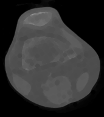
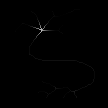

```{r setup, include=FALSE}
knitr::opts_chunk$set(echo = TRUE)
```

This reference manual is an overview of how to use PyIFT function, objects and how to update its wrapper file, `pyift.i`.  

# Installing

### Dependencies

* LibIFT Latest Version
* Python >= 3.4
* NumPy >= 1.12.1
* Matplotlib >= 2.0.2

### Compiling

The PyIFT is located in the `<NEWIFT_DIR>/swig` directory.

While the PyIFT is in development it's recommended to install this way, because we don't need to install the module every time we updated it.

To find the correct path to install it use on your Python 3 console:

```{python, engine.path = '/usr/bin/python3'}
import site
print(site.getsitepackages())
```


```{bash, eval = FALSE}
cd <NEWIFT_DIR>/swig
make
sudo ln -s <NEWIFT_DIR>/swig/_pyift.so <PYTHON_PACKAGES_PATH>/_pyift.so
sudo ln -s <NEWIFT_DIR>/swig/pyift.py <PYTHON_PACKAGES_PATH>/pyift.py
```

When this version is complete we will be using a `setup.py` and `pip3 install` as an usual Python module to easily install this toolbox.

## PyIFT Basics

### **pyift.i Structures**

The LibIFT structures are treated similarly to C++ classes in the `pyift.i` because every object created inside a C function will not be freed by
the Python garbage collector.

When adding an object to the .i file that will be used as pointer and its memory will be allocated on the inside of a function it's necessary to extend the C
struct to declare the destructor, to do this you need to declare the struct using only `typedef struct`, not the `typedef struct ift_objectname` as usual
and using the swig feature `%extend` right below, this can also be used to insert Python methods into the C struct, as the example below.

The swig feature `%newobject` is designed to indicate to the target language that it should take ownership of the returned object, every function
that allocates memory and don't free it needs this feature to avoid memory leaks.

```{c, eval = FALSE}
typedef struct {
    int *dx, *dy, *dz;
    int n;
} iftAdjRel;

%extend iftAdjRel {
    /* Destructor */
    ~iftAdjRel() {
        iftAdjRel *ptr = ($self);
        iftDestroyAdjRel(&ptr);
    }
    
    PyObject* __getitem__(int i){
        PyObject *displacement = PyTuple_New(3);

        PyTuple_SetItem(displacement, 0, PyInt_FromLong(($self)->dx[i]));
        PyTuple_SetItem(displacement, 1, PyInt_FromLong(($self)->dy[i]));
        PyTuple_SetItem(displacement, 2, PyInt_FromLong(($self)->dz[i]));

        return displacement;
    }

    void Write(char* filename){
        iftAdjRel* A = ($self);
        iftWriteAdjRel(A, filename);
    }
}

/* Declaring memory allocation of new object */

%newobject iftCircular;
iftAdjRel *iftCircular(float r);
```

The `$self` is a special pointer variable that accesses the object own address.

Most of the objects in the PyIFT can be used with methods following the Object-Oriented Programming paradigm or with functions equal to the LibIFT.

### PyIFT Objects

The PyIFT toolbox includes most of C structures of the LibIFT but on the Python environment you can't access elements inside a struct, except when using the swig feature "%extend" as described above.

Here are a few data types that are available on the PyIFT and how to use them.

#### **iftImage**

The iftImage is the main structure of the LibIFT, its default color space is YCbCr.

```{python, engine.path = '/usr/bin/python3'}
import pyift as ift

img = ift.ReadImageByExt("Lenna.png")

# Pixels can be accessed and altered inside the C struct through Python

print("Pixel[0] (Y, Cb, Cr): " + str(img[0]))

img[0] = (1, 2, 3)

print("Pixel[0] (Y, Cb, Cr): " + str(img[0]))

# After image is initialized it can be displayed as numpy array and receive information from numpy objects

import numpy as np

# FromNumPy(np.array, shape)
img.FromNumPy(np.array([[1,2,3],[4,5,6],[7,8,9]], dtype = "int32"), (3,3))

print("Image new number of pixels: " + str(img.n))

print("Image data:")
print(img.AsNumPy())

```

```{python, engine.path = '/usr/bin/python3', results = FALSE}
import pyift as ift
import matplotlib.pyplot as plt

img = ift.ReadImageByExt("Lenna.png")

# Show image, must use compatible IDE
plt.imshow(img.ToPlot())

# Saving compy of Lenna.png
img.Write("copy_Lenna.png")

```


#### **iftMImage**

The iftMImage is the multi-band version of iftImage, when using its index it returns the whole image from that band index, not the pixel value as the iftImage.

```{python, engine.path = '/usr/bin/python3', results = FALSE}
import pyift as ift
import matplotlib.pyplot as plt

img = ift.ReadImageByExt("Lenna.png")

mimg = ift.ImageToMImage(img, ift.YCbCr_CSPACE)

img_gray = mimg[0]

```

#### **iftFImage**

The iftFImage is the floating point variant of iftImage, it works only for grayscale images.

#### **iftLabeledSet**

The iftLabeledSet is used to store the markers from the interactive methods of image segmentation,
knowing that its functionality relies on its size manipulation to easily updates its quantity as 
the user changes the markers on the interface, its methods emulate set (math) operations.

```{python, engine.path = '/usr/bin/python3'}
import pyift as ift

img = ift.ReadImageByExt("airplane.png")

seeds_0 = ift.ReadSeedsComplete("airplane_0_label.txt", img)
seeds_1 = ift.ReadSeedsComplete("airplane_1_label.txt", img)

print("Seeds of Label 0")
print(seeds_0.AsDict())
print("Seeds of Label 1")
print(seeds_1.AsDict())

seeds_both = seeds_0 + seeds_1

print("Addition")
print(seeds_both.AsDict())

print("Subtraction")
print((seeds_both - seeds_1).AsDict())
```


#### **ifAdjRel**

This object is used to access the adjacents pixels of a given pixel, it's mostly used as
a parameter for morphology and segmentation functions.

#### **iftKernel**

It's a weighted adjacency relation object, also known as convolution matrix.

### PyIFT Operations

PyIFT functions descriptions for image description, segmentation and math morphology.

#### iftImage **Erode**(iftImage img, iftAdjRel A)

Grow image regions.

#### iftImage **Dilate**(iftImage img, iftAdjRel A)

Shrink image regions.

#### iftImage **Close**(iftImage img, iftAdjRel A)

Structured removal of image region boundary pixels.

#### iftImage **Open**(iftImage img, iftAdjRel A)

Structured filling of image region boundary pixels.

```{python, engine.path = '/usr/bin/python3'}
import pyift as ift
import math as m

img = ift.ReadImageByExt("knee.png")

A = ift.Circular(m.sqrt(10.0))

eroded_img = ift.Erode(img, A)

eroded_img.Write("eroded-knee.png")

dilated_img = ift.Dilate(img, A)

dilated_img.Write("dilated-knee.png")

```

|  |  |  |
|:----------------------------:|:--------------------:|:--------------------:|
| *Magnetic Resonance of Knee* |  *Eroded Knee Image* | *Dilated Knee Image* |


#### iftFImage **IntegralImage**(iftImage img)

Compute integral image of the luminance band of the image.

#### iftImage **DistTrans**(iftImage binary, iftAdjRel A, int Side)

Returns image distance transform, Side must be an integer (0: Interior, 1: Exterior, 2: Both).

#### iftFImage **MSSkel**(iftImage binary)

Multiscale skeleton by geodesic distance.

#### iftImage **SurfaceSkeleton**(iftFImage skeleton, float threshold, int number of components)

Generates surface skeleton by thresholding the geodesic skeleton than selects a given number of components.

####  iftImage **MedialAxisTrans2D**(iftImage binary, float threshold, char Side)

Runs the medial axis transform in 2D, such that the output is a 2D skeleton image with the squared Euclidian
distance from the skeleton points to the objects boundaries.

#### iftImage **ShapeReconstruction**(iftImage medial axis, int reconstruction value)

It's a shape smoothing filter that reconstructs the shape from the medial axis image.

```{python, engine.path = '/usr/bin/python3', results = FALSE}
import pyift as ift

leaf_img = ift.ReadImageByExt("leaf.png")

skel_leaf = ift.MSSkel(leaf_img)
skel_leaf.Write("skel_leaf.png")

neuron_img = ift.ReadImageByExt("neuron.png")

medial_axis_neuron = ift.MedialAxisTrans2D(neuron_img, 7, 0)
medial_axis_neuron.Write("medial_axis_neuron.png")

new_neuron_img = ift.ShapeReconstruction(medial_axis_neuron, 255)
new_neuron_img.Write("reconstructed_neuron.png")

```
|  |  |  |  |  |
|:------------:|:----------------------|:---------------|:---------------------:|:----------------------:|
| *Leaf Image* | *Leaf Image Skeleton* | *Neuron Image* |  *Neuron Medial Axis* | *Reconstructed Neuron* |

#### iftImage **EnhanceObject**(iftImage mimg, iftLabeledSet seeds, int object label)

A filter used to enhance image's object by computing object map based on the distances between each voxel and its closest roots in each set: object root set and background root set. This method is used in pre-processing for image segmentation by watershed transforms.

#### iftImage **MEnhanceObject**(iftMImage mimg, iftLabeledSet seeds, int object label)

A filter used to enhance a MImage's object by computing object map based on the distances between each voxel and its closest roots in each set: object root set and background root set. This method is used in pre-processment for image segmentation by watershed transforms.

#### iftImage **EnhanceEdges**(iftImage img, iftAdjRel A, iftLabeledSet seeds, float alpha)

Filter all objects in the image and then combine them resulting in the enhancement of all edges.

#### iftImage **MEnhanceEdges**(iftMImage mimg, iftAdjRel A, iftLabeledSet seeds, float alpha)

Filter all objects in the MImage and then combine them resulting in the enhancement of all edges.

#### iftImage **ImageBasins**(iftImage img, iftAdjRel A)

Computes a gradient-like image that considers the average absolute difference between voxels.

#### iftImage **ImageDomes**(iftImage img, iftAdjRel A)

Return image domes by the complement of the image's basins.

#### iftImage **TextGradient**(iftImage img)

Compute texture gradient of given image.

#### iftImage **Watershed**(iftImage basins, iftAdjRel A, iftLabeledSet seeds, iftSet forbidden)

Computes the Watershed Transform from a set of labeled markers.

#### iftImage **WaterGray**(iftImage basins, iftImage marker, iftAdjRel A)

Watershed transforms from grayscale markers: Note that, in order to obtain a connected operator for some graph
topology, the adjacency relation must be the same used to compute the input image.

#### iftImage **OrientedWatershed**(iftImage orien, const iftImage basins, iftAdjRel A, iftLabeledSet seed, int orientation, iftSet forbidden)

Computes the Watershed Transform based on a given orientation (fuzzy object map), orientation 1 if object brighter than outside, 0 if object darker than outside.

#### int **Otsu**(iftImage img)

Return threshold value by Otsu Method.

#### int **OtsuInRegion**(iftImage img)

Applies the Otsu Method in Regions defined by a Mask Image.

#### iftImage **Threshold**(iftImage img, int lowest, int highest, int value)

In case the image's voxel has an intensity between the floor and ceiling Threshold, then, the image's voxel receives the parameter value, otherwise, it receives 0.

```{python, engine.path = '/usr/bin/python3', eval = FALSE}
import pyift as ift
import matplotlib.pyplot as plt

img = ift.ReadImageByExt("parasite.png")

A = ift.Circular(1.0)

seeds = ift.ReadSeedsComplete("parasite.txt", img)

basins = ift.ImageBasins(img, A)

label = ift.Watershed(basins, A, seeds, None)

plt.imshow(img.ToPlot())
plt.imshow(label.ToPlot())

```
|  |  |
|:--------------------------------:|:----------------------------------------|
| *Parasite Image Plot*            |                *Segmentated Image Plot* |


### List of functions of PyIFT 0.1

iftFImage **FCopyImage**(iftFImage img)

iftFImage  **CreateFImage**(int xsize, int ysize, int zsize)

iftFImage  **ImageToFImage**(iftImage img)

iftImage   **FImageToImage**(iftFImage img, int Imax)

iftFImage  **FReadImage**(char filename)

iftHistogram **CreateHistogram**(int nbins)

iftHistogram **ReadHistogram**(char filename)

iftHistogram **GrayHistogram**(iftImage img, int nbins, bool normalize)

iftImage **ReadImageByExt**(char filename, ...)

iftFImage **IntegralImage**(iftImage img)

float **iftGetIntegralValueInRegion**(iftFImage integ, iftVoxel v, int npts)

iftLabeledSet **ReadSeeds**(char filename, iftImage img)

iftLabeledSet **ReadSeedsComplete**(char filename, iftImage img)

iftLabeledSet **ReadSeeds2D**(char filename, iftImage img)

iftSet **ExtractRemovalMarkers**(iftLabeledSet s)

iftLabeledSet **LabelObjBorderSet**(iftImage bin, iftAdjRel A)

iftLabeledSet **ImageBorderLabeledSet**(iftImage img)

iftLabeledSet **LabelCompSet**(iftImage bin, iftAdjRel A)

iftLabeledSet **FuzzyModelToLabeledSet**(iftImage model)

iftLabeledSet **MAdjustSeedCoordinates**(iftLabeledSet S, iftMImage input, iftMImage output)

iftLabeledSet **AdjustSeedCoordinates**(iftLabeledSet Sin, iftImage orig, iftMImage output)

iftSet        **ImageBorderSet**(iftImage img)

iftLabeledSet **MultiObjectBorderLabeledSet**(iftImage img, iftAdjRel A)

iftImage **LabeledBorders**(iftImage label, iftAdjRel A)

iftAdjRel **CreateAdjRel**(int n)

iftAdjRel **Spheric**(float r)

iftAdjRel **Hemispheric**(float r, char axis, int direction)

iftAdjRel **SphericEdges**(float r)

iftAdjRel **Circular**(float r)

iftAdjRel **CircularEdges**(float r)

iftAdjRel **ClockCircular**(float r)

iftAdjRel **RightSide**(iftAdjRel A, float r)

iftAdjRel **LeftSide**(iftAdjRel A, float r)

iftAdjRel **Rectangular**(int xsize, int ysize)

iftAdjRel **Cuboid**(int xsize, int ysize, int zsize)

iftAdjRel **CopyAdjacency**(iftAdjRel A)

void iftMaxAdjShifts**(iftAdjRel A, int dx, int dy, int dz)

iftAdjRel **ReadAdjRel**(char filename)

iftVoxel iftGetAdjacentVoxel**(iftAdjRel A, iftVoxel u, int adj)

int iftIsAdjRel3D**(iftAdjRel A)

iftImage  **LinearFilter**(iftImage img, iftKernel K)

iftImage  **LinearFilterInRegion**(iftImage img, iftImage mask, iftKernel K)

iftImage  **FastLinearFilter**(iftImage img, iftKernel K, char crop)

iftFImage **FLinearFilter**(iftFImage img, iftKernel K)

iftFImage  **FLinearFilterInRegion**(iftFImage img, iftImage mask, iftKernel K)

iftFImage **FastFLinearFilter**(iftFImage img, iftKernel K, char crop)

iftMImage **MLinearFilter**(iftMImage img, iftMKernel K)

iftMImage  **ImageToMImage**(iftImage img, char color_space) 

iftImage  **MedianFilter**(iftImage img, iftAdjRel A)

iftMImage **MMedianFilter**(iftMImage img, iftAdjRel A)

iftImage  **ModaFilter**(iftImage img, iftAdjRel A)

iftImage  **SobelGradientMagnitude**(iftImage img)

iftMatrix **ImageToMatrix**(iftImage img, iftFastAdjRel F, char crop)

iftMatrix **ImageAdjToMatrix**(iftImage img, iftAdjRel A)

iftImage  **MatrixToImage**(iftMatrix M, int xsize, int ysize, int zsize)

iftMatrix **FImageToMatrix**(iftFImage img, iftFastAdjRel F, char crop)

iftFImage  **MatrixToFImage**(iftMatrix M, int xsize, int ysize, int zsize)

iftMatrix **MImageToMatrix**(iftMImage img, iftFastAdjRel F)

iftMImage **MatrixToMImage**(iftMatrix M, int xsize, int ysize, int zsize, int nbands)

iftMatrix KernelToMatrix**(iftKernel K)

iftMatrix **MKernelToMatrix**(iftMKernel K)

iftMatrix **MMKernelToMatrix**(iftMMKernel K_bank)

iftImage **SmoothImage**(iftImage img, iftAdjRel A, float sigma)

iftImage **SmoothImageInRegion**(iftImage img, iftImage mask, iftAdjRel A, float sigma)

iftImage **MImageToImage**(iftMImage img1, int Imax, int band)

iftKernel   **CreateKernel**(iftAdjRel A)

iftKernel   **ReadKernel**(char filename)

iftMKernel  **CreateMKernel**(iftAdjRel A, int nbands)

iftMKernel  **RandomMKernel**(iftAdjRel A, int nbands)

iftMMKernel **CreateMMKernel**(iftAdjRel A, int nbands, int nkernels)

iftMKernel  **CopyMKernel**(iftMKernel K)

iftMMKernel **ReadMMKernel**(char filename)

iftMMKernel **CopyMMKernel**(iftMMKernel K)

iftMMKernel  **iftUnionMMKernel**(iftMMKernel K1, iftMMKernel K2)

iftMMKernel **RandomMMKernel**(iftAdjRel A, int nbands, int nkernels)

iftMMKernel **iftV1likeMMKernel2D**(int sizex,int sizey, int nbands, int norients, int nfreqs, float freqs)

iftMMKernel **RandomZMMMKernel**(iftAdjRel A, int nbands, int nkernels)

iftMMKernel **OnesMMKernel**(iftAdjRel A, int nbands, int nkernels)

iftKernel   **GaussianKernel**(float radius, float stdev)

iftKernel   **GaussianKernel2D**(float radius, float stdev)

iftKernel   **SobelXKernel**(void)

iftKernel   **SobelYKernel**(void)

iftKernel   **SobelZKernel**(void)

iftKernel   **SobelXKernel2D**(void)

iftKernel   **SobelYKernel2D**(void)

iftKernel   **DoGKernel**(float stdev1, float stdev2)

iftKernel   **DoGKernel2D**(float stdev1, float stdev2)

iftKernel   **Gabor2D**(float gw,float gh,float gx0,float gy0,float wfreq,float worient,float wphase,iftAdjRel A)

iftKernel   **UniformKernel**(iftAdjRel A)

iftMatrix **CreateMatrix**(int ncols, int nrows)

iftDoubleMatrix **CreateDoubleMatrix**(int ncols, int nrows)

iftMatrix **CopyMatrix**(iftMatrix A)

iftImage **DilateWithKernel**(iftImage img, iftKernel K)

iftImage **ErodeWithKernel**(iftImage img, iftKernel K)

iftImage **CloseWithKernel**(iftImage img, iftKernel K)

iftImage **OpenWithKernel**(iftImage img, iftKernel K)

iftImage **Dilate**(iftImage img, iftAdjRel A)

iftImage **Erode**(iftImage img, iftAdjRel A)

iftImage **Close**(iftImage img, iftAdjRel A)

iftImage **Open**(iftImage img, iftAdjRel A)

iftImage **MorphGrad**(iftImage img, iftAdjRel A)

iftImage **SupRec**(iftImage img, iftImage marker)

iftImage **OpenRec**(iftImage img, iftAdjRel A)

iftImage **CloseRec**(iftImage img, iftAdjRel A)

iftImage **AsfCORec**(iftImage img, iftAdjRel A)

iftImage **AsfOCRec**(iftImage img, iftAdjRel A)

iftImage **AsfCO**(iftImage img, iftAdjRel A)

iftImage **AsfOC**(iftImage img, iftAdjRel A)

iftImage **AsfCOBin**(iftImage bin, float radius)

iftImage **AsfOCBin**(iftImage bin, float radius)

iftImage **CloseBasins**(iftImage img, iftSet seed, iftImage mask)

iftImage **OpenDomes**(iftImage img, iftSet seed, iftImage mask)

iftImage AreaClose**(iftImage img, int area_thres)

iftImage AreaOpen**(iftImage img, int area_thres)

iftImage **FastAreaClose**(iftImage img, int thres)

iftImage **FastAreaOpen**(iftImage img, int thres)

iftImage **VolumeOpen**(iftImage img, int volume_thres)

iftImage **VolumeClose**(iftImage img, int volume_thres)

iftImage **DilateInRegion**(iftImage img, iftImage mask, iftAdjRel A)

iftImage **ErodeInRegion**(iftImage img, iftImage mask, iftAdjRel A)

iftImage **CloseInRegion**(iftImage img, iftImage mask, iftAdjRel A)

iftImage **OpenInRegion**(iftImage img, iftImage mask, iftAdjRel A)

iftImage **CloseRecInRegion**(iftImage img, iftImage mask, iftAdjRel A)

iftImage **OpenRecInRegion**(iftImage img, iftImage mask, iftAdjRel A)

iftImage **SupRecInRegion**(iftImage img, iftImage marker, iftImage mask)

iftImage **DilateBin**(iftImage bin, iftSet seed, float radius)

iftImage **ErodeBin**(iftImage bin, iftSet seeds, float radius)

iftImage **CloseBin**(iftImage bin, float radius)

iftImage **OpenBin**(iftImage bin, float radius)

iftImage **CloseRecBin**(iftImage bin, float radius)

iftImage **OpenRecBin**(iftImage bin, float radius)  

iftImage **HBasins**(iftImage img, int H)

iftImage **HDomes**(iftImage img, int H)

iftFImage **GeodesicDistTrans**(iftSet S, iftImage mask, iftAdjRel A)

iftImage **DistTrans**(iftImage bin, iftAdjRel A, char side)

iftImage **BorderDistTrans**(iftImage label, iftAdjRel A)

iftImage **ShellDistTrans**(iftImage bin, iftAdjRel A, char side, float max_dist)

void **iftDistTransRootMap**(iftImage bin, iftAdjRel A, char side, iftImage dist, iftImage root)

iftFImage **SignedDistTrans**(iftImage bin, iftAdjRel A)

iftFImage **ShellSignedDistTrans**(iftImage bin, iftAdjRel A,float max_dist)

iftFImage **MSSkel**(iftImage bin)

iftImage **SurfaceSkeleton**(iftFImage skel, float thres, int number_of_components) 

iftFImage **MSSkel2DDistMap**(iftImage bin, iftAdjRel A, char side, iftImage dist)

iftFImage  **MSSkel2D**(iftImage bin, iftAdjRel A, char side)

iftImage **IntMSSkel2D**(iftImage bin, iftAdjRel A, char side)

void **MultiLabelDistTransFromBorders**(iftImage label, iftAdjRel A, char side, iftImage dist, iftImage root)

void **MultiLabelShellDistTransFromSet**(iftSet S, iftImage label, iftAdjRel A, char side, double max_dist, iftImage dist, iftImage root)

void **MultiLabelDistTransFromSet**(iftSet S, iftImage label, iftAdjRel A, char side, iftImage dist, iftImage root)

void **DistTransAttributes**(iftImage bin, iftAdjRel A, char side, iftImage root, iftImage label, iftImage dist, iftImage pred)

iftImage **NumberOfDescendantsInTarget**(iftImage pred, iftImage target_bin)

iftImage **NumberOfAscendants**(iftImage pred)

iftImage **NumberOfDescendants**(iftImage pred)

iftFImage **MultiLabelSignedDistTransFromBorders**(iftImage label, iftAdjRel A, char side, iftImage root)

iftImage **RootPropagation**(iftImage bin, iftAdjRel A, char side, float max_dist)

iftFImage **LabelContPixelByGeoLen**(iftImage bin)

iftImage **LiftImage**(iftImage img)

iftImage  **DropImage**(iftImage bin)

iftFImage **IntegralImage**(iftImage img)

float *GetIntegralValueInRegion**(iftFImage integ, iftVoxel v, int npts)

iftImage **MarkGeometricCenters**(iftImage bin)

iftImage **ComponentSizes**(iftImage bin, iftAdjRel A)

iftImage **BorderSize**(iftImage bin)

iftImage **MedialAxisTrans2D**(iftImage bin, float scale_thres, char side)

iftImage **ShapeReconstruction**(iftImage medial_axis, int value)

iftImage  **TerminalPoints2D**(iftImage skel)

iftSet **TerminalPointSet2D**(iftImage skel)

iftImage **EnhanceObject**(iftImage img, iftLabeledSet seed, int obj)

iftImage **EnhanceEdges**(iftImage img, iftAdjRel A, iftLabeledSet seed, float alpha)

iftImage *MEnhanceObject**(iftMImage img, iftLabeledSet seed, int obj)

iftImage **MEnhanceEdges**(iftMImage img, iftAdjRel A, iftLabeledSet seed, float alpha)

iftImage **ImageDomes**(iftImage  img, iftAdjRel A)

iftImage **ImageBasins**(iftImage img, iftAdjRel Ain)

iftImage **ApplySShape**(iftImage img, int a, int b, int c)

iftFImage **GradientVectorField**(iftImage img, iftImage mask)

iftImage **TextGradient**(iftImage img)

iftImage **ComputeGradient**(iftImage img, iftGradientAlg grad_alg)

iftImage **CombineGradImages**(iftImage grad_img1, iftImage grad_img2, float alpha, int max_img_range)

iftImage **Watershed**(iftImage basins, iftAdjRel Ain, iftLabeledSet seeds, iftSet forbidden)

iftImage **WatershedMeanCut**(iftImage basins, iftAdjRel Ain, iftLabeledSet seeds, iftSet forbidden, float result)

iftImage  **RelaxedWatershed**(iftImage basins, iftAdjRel A, iftLabeledSet seed, int num_smooth_iterations, float smooth_factor)

iftImage  **EnhanceWhenCrIsGreaterThanCb**(iftImage img)

iftFImage **WeightNormFactor**(iftFImage weight, iftAdjRel A)

iftImage  **WaterGray**(iftImage basins, iftImage marker, iftAdjRel A)

iftImage  **WaterDist**(iftImage dist, iftImage label, int H, iftAdjRel A)

iftImage  **DualWaterGray**(iftImage domes, iftImage marker, iftAdjRel A)

iftImage **DualWaterGrayOnMask**(iftImage domes, iftImage marker, iftImage mask, iftAdjRel  A, iftSet roots)

iftImage **OrientedWatershed**(iftImage orien, iftImage basins, iftAdjRel A, iftLabeledSet seed, char orientation, iftSet forbidden)

int **CumHistogramThres**(iftImage img, float perc)

int **Otsu**(iftImage img)

int **OtsuInRegion**(iftImage img, iftImage mask)

iftImage  **Threshold**(iftImage img, int lowest, int highest, int value)

iftImage  **FThreshold**(iftFImage img, float lowest, float highest, int value)

iftImage  binarizeByOPF**(iftImage orig, iftImage enha, int init_thres, float train_perc)

iftImage  AboveAdaptiveThreshold**(iftImage img, iftImage mask, iftAdjRel A, float perc, int niters, int value)

iftImage  **BelowAdaptiveThreshold**(iftImage img, iftImage mask, iftAdjRel A, float perc, int niters, int value)

iftFImage **SmoothWeightImage**(iftImage basins, float beta)

iftImage **FastSmoothObjects**(iftImage labelIn, iftFImage weight, int n_iters)

iftImage **FastSmoothObjectsInsideBB**(iftImage label1, iftFImage weight, iftImage block_img,int niters)

iftImage **BorderImageToLabelImage**(iftImage border)

iftImage **BorderImage**(iftImage label, char get_margins)

float **FBetaScore**(iftImage bin, iftImage gt, float beta)

float **FScoreError**(iftImage bin, iftImage gt)

float **FScoreMultiLabel**(iftImage mlabel, iftImage mlgt, int number_of_objects)

iftErrorClassification **SegmentationErrors**(iftImage gt_image, iftImage cl_image)

float **BoundaryRecall**(iftImage gt, iftImage border, float tolerance_dist)

float **UnderSegmentationSLIC**(iftImage gt, iftImage label, float perc_of_intersection)

float **UnderSegmentation**(iftImage gt_image, iftImage label_image)

float **TopologyMeasure**(iftImage label)

float **Compactness2D**(iftImage label)

iftImage **SelectAndPropagateRegionsAboveArea**(iftImage label, int area)

iftImage **SelectAndPropagateRegionsAboveAreaByColor**(iftImage img, iftImage label, int area)

iftImage **SmoothRegionsByDiffusion**(iftImage label_img, iftImage orig_img, float smooth_factor, int n_iters)

iftImage **SmoothRegionsByDiffusionInsideBB**(iftImage label, iftImage orig, iftImage block_img,float smooth_factor, int niters)

char **IsSegmentationConsistent**(iftImageForest fst)

int **IsLabelRootConnected**(iftImage pred, iftImage label, int p)

iftLabeledSet **LabelToForestGeodesicRobot**(iftImage gradient,iftImage label, int seeds_per_iteration, int number_of_objects, int min_distance_border, int max_marker_size, int min_marker_size)

iftLabeledSet **ShiftCoordsFromLabeledSet**(iftLabeledSet S, iftImage img, int dx, int dy, int dz)

iftSet **ShiftCoordsFromSet**(iftSet S, iftImage img, int dx, int dy, int dz)

iftImage **ConnectedThreshold**(iftImage img, iftAdjRel A, iftImage marker, int minthres, int maxthres)

iftImage **MajorityVoting**(iftImage img, iftIntMatrix label_occurs)

iftImage **DescendantMap**(iftImage pred, iftAdjRel A, iftBMap set_of_interest)

